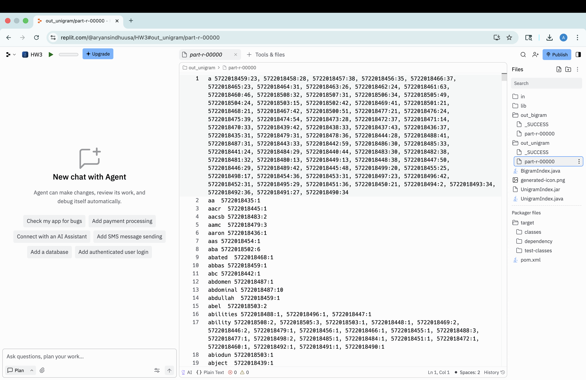
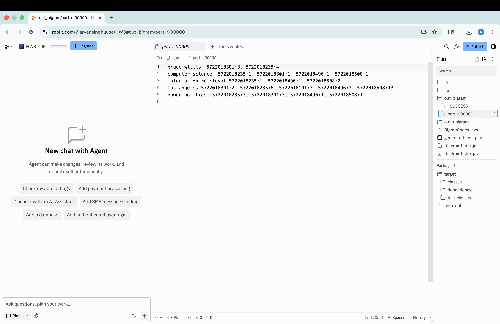

# 🔎 Inverted Index & Text Processing using Hadoop MapReduce

A **Java and Hadoop MapReduce** implementation for building unigram and bigram inverted indexes from large collections of text documents.

The project transforms raw document text into searchable term-to-document mappings while computing **per-document term frequencies**, demonstrating core concepts used in information retrieval and distributed text processing.

---

## 📌 About the Project

An **inverted index** maps terms to the documents in which they occur.

Instead of storing:

```text
Document → Words
```

an inverted index stores:

```text
Word → Documents containing the word
```

This data structure is a fundamental component of information retrieval systems and search engines.

This project implements two MapReduce indexing pipelines:

* **Unigram Inverted Index** — indexes individual terms
* **Bigram Inverted Index** — indexes selected consecutive two-word phrases

Each posting also contains the **term frequency within the document**.

---

## ✨ Features

* 🔤 Unigram inverted-index generation
* 🔗 Bigram inverted-index generation
* 📄 Document-level postings lists
* 🔢 Per-document term-frequency counting
* 🧹 Text normalization and preprocessing
* 🔡 Case normalization
* ✂️ Punctuation and numeric-character removal
* ⚙️ Hadoop Mapper/Reducer architecture
* 🗂️ HashMap-based term-frequency aggregation
* 📊 Large text-collection processing

---

## 🛠️ Technologies Used

* **Java**
* **Apache Hadoop**
* **Hadoop MapReduce**
* **Java Collections**
* **HashMap**
* **HashSet**
* **Regular Expressions**
* **Information Retrieval**
* **Text Processing**

---

## 🧠 What is an Inverted Index?

Suppose we have these documents:

```text
Document 1: information retrieval systems
Document 2: information retrieval algorithms
Document 3: computer science
```

A basic inverted index could look like:

```text
computer      → Document 3
information   → Document 1, Document 2
retrieval     → Document 1, Document 2
science       → Document 3
systems       → Document 1
algorithms    → Document 2
```

This project extends that idea by storing the **frequency of each term in each document**.

For example:

```text
information → doc1:3, doc2:5, doc3:1
```

means that `information` occurs:

* 3 times in `doc1`
* 5 times in `doc2`
* 1 time in `doc3`

---

## 🏗️ MapReduce Architecture

```text
              ┌──────────────────────────┐
              │      Input Documents     │
              │     docID + content      │
              └────────────┬─────────────┘
                           │
                           ▼
              ┌──────────────────────────┐
              │       Preprocessing      │
              │                          │
              │ • Convert to lowercase   │
              │ • Remove punctuation     │
              │ • Remove numbers         │
              │ • Tokenize text          │
              └────────────┬─────────────┘
                           │
                           ▼
              ┌──────────────────────────┐
              │          Mapper          │
              └────────────┬─────────────┘
                           │
                   word → document ID
                           │
                           ▼
              ┌──────────────────────────┐
              │     Shuffle & Sort       │
              │ Group identical terms    │
              └────────────┬─────────────┘
                           │
                           ▼
              ┌──────────────────────────┐
              │         Reducer          │
              │                          │
              │ HashMap<docID, count>    │
              └────────────┬─────────────┘
                           │
                           ▼
              ┌──────────────────────────┐
              │      Inverted Index      │
              │                          │
              │ term → docID:frequency   │
              └──────────────────────────┘
```

---

# 🔤 Unigram Inverted Index

The unigram index processes individual words from the document collection.

## Mapper

The mapper:

1. Extracts the document ID
2. Converts document content to lowercase
3. Replaces punctuation and numeric characters with spaces
4. Tokenizes the normalized text
5. Emits each term with its document ID

Conceptually:

```text
(word, docID)
```

For example:

```text
retrieval → 5722018235
retrieval → 5722018235
retrieval → 5722018508
```

---

## Reducer

The reducer groups all occurrences of a word and uses a `HashMap` to count how many times the term appears in each document.

```text
HashMap<docID, frequency>
```

The resulting posting list has the form:

```text
word    docID:count, docID:count, ...
```

Example:

```text
retrieval    5722018235:4, 5722018508:2
```

---

# 🔗 Bigram Inverted Index

A **bigram** consists of two consecutive words.

For example:

```text
computer science
information retrieval
los angeles
```

The bigram MapReduce pipeline identifies selected two-word phrases and creates document-frequency postings for them.

The project indexes these five phrases:

```text
computer science
information retrieval
power politics
los angeles
bruce willis
```

---

## Bigram Processing

After preprocessing, adjacent tokens are combined:

```text
word[i] + " " + word[i + 1]
```

For example:

```text
information retrieval systems
```

produces:

```text
information retrieval
retrieval systems
```

A `HashSet` is used to efficiently determine whether a generated bigram belongs to the selected set.

Only selected bigrams are emitted by the mapper.

---

## 📊 Bigram Results

The generated index includes:

```text
bruce willis
→ 5722018301:3, 5722018235:4
```

```text
computer science
→ 5722018235:1, 5722018301:1, 5722018496:1, 5722018508:1
```

```text
information retrieval
→ 5722018235:1, 5722018496:1, 5722018508:2
```

```text
los angeles
→ 5722018301:2, 5722018235:6, 5722018101:3, 5722018496:2, 5722018508:13
```

```text
power politics
→ 5722018235:3, 5722018301:3, 5722018496:1, 5722018508:1
```

For example, the result:

```text
los angeles → 5722018508:13
```

indicates that the phrase **"los angeles" occurs 13 times in document `5722018508`**.

---

## 🧹 Text Preprocessing

Before indexing, document text is normalized.

The implementation converts text to lowercase:

```java
content.toLowerCase()
```

and removes non-alphabetic characters:

```java
replaceAll("[^a-z\\s]", " ")
```

For example:

```text
Information Retrieval, 2025!
```

becomes:

```text
information retrieval
```

This ensures that variations such as:

```text
Information
INFORMATION
information
information,
```

are indexed consistently.

---

## 📁 Project Structure

```text
hadoop-inverted-index/
│
├── README.md
├── .gitignore
│
├── src/
│   ├── UnigramIndex.java
│   └── BigramIndex.java
│
├── output/
│   ├── unigram_index.txt
│   └── selected_bigram_index.txt
│
└── screenshots/
    ├── unigram-output.png
    └── bigram-output.png
```

---

## 📚 Dataset

Two document collections were used:

### Development Dataset

```text
devdata/
└── 5 text files
```

Used for development/testing and selected bigram indexing.

### Full Dataset

```text
fulldata/
└── 74 text files
```

Used to generate the full unigram inverted index.

Each input record follows a key-value structure:

```text
docID<TAB>document contents
```

Example:

```text
5722018101    document text goes here...
```

The document ID becomes the identifier stored in the inverted-index postings.

---

## ⚙️ Running the MapReduce Jobs

The jobs expect two arguments:

```text
<input-directory> <output-directory>
```

### Compile / Package

Compile the Java source with the appropriate Hadoop dependencies available on the classpath.

### Run Unigram Index

```bash
hadoop jar inverted-index.jar UnigramIndex \
  input/fulldata \
  output/unigram
```

The resulting Hadoop output can then be saved as:

```text
unigram_index.txt
```

### Run Bigram Index

```bash
hadoop jar inverted-index.jar BigramIndex \
  input/devdata \
  output/bigram
```

The resulting output can be saved as:

```text
selected_bigram_index.txt
```

> Hadoop requires the specified output directory not to already exist before starting a new MapReduce job.

---

## 📤 Output Format

### Unigram Index

```text
term    docID:count, docID:count, ...
```

Example:

```text
algorithm    5722018101:2, 5722018235:4
```

### Bigram Index

```text
bigram    docID:count, docID:count, ...
```

Example:

```text
information retrieval    5722018235:1, 5722018496:1, 5722018508:2
```

---

## 📸 Screenshots

### 🔤 Unigram MapReduce Output



### 🔗 Bigram MapReduce Output



---

## 🔑 Key Implementation Details

### HashMap-Based Aggregation

The reducer uses:

```java
HashMap<String, Integer>
```

to aggregate term frequencies by document.

Conceptually:

```text
term
 │
 ├── document A → count
 ├── document B → count
 └── document C → count
```

This produces compact postings lists containing both document IDs and term frequencies.

### HashSet-Based Bigram Filtering

The bigram mapper uses a `HashSet` containing the selected phrases.

This allows generated bigrams to be efficiently checked before being emitted to the MapReduce pipeline.

---

## 💡 What I Learned

Through this project, I gained hands-on experience with:

* Understanding inverted-index data structures
* Implementing information-retrieval indexing pipelines
* Developing Hadoop MapReduce jobs in Java
* Designing custom Mapper and Reducer logic
* Building unigram and bigram indexes
* Computing document-level term frequencies
* Processing large text collections
* Normalizing and tokenizing textual data
* Using Java `HashMap` for frequency aggregation
* Using Java `HashSet` for efficient phrase filtering
* Understanding the Map → Shuffle/Sort → Reduce workflow
* Generating document postings lists
* Working with Hadoop input and output directories

---

## 🔎 Information Retrieval Context

Inverted indexes are a foundational data structure behind search engines.

They enable systems to quickly determine which documents contain a query term without scanning every document at query time.

The per-document frequency information generated by this project can also serve as an input to ranking techniques that use **term frequency (TF)** and related information-retrieval statistics.

---

## 👤 Author

**YOUR NAME**

* **LinkedIn:** [LinkedIn Profile](https://www.linkedin.com/in/aryansindhu/)
* **GitHub:** [GitHub Profile](https://github.com/aryansindhu8/)

---

⭐ If you found this project interesting, feel free to star the repository.
